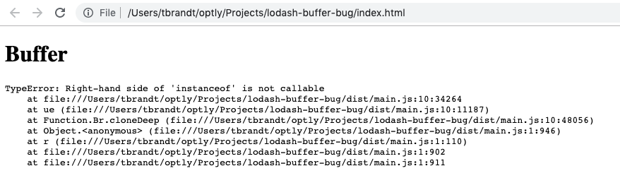

# lodash-buffer-bug

[SSCCE](http://sscce.org/) for a bug in lodash 4.6.1, where if there is an element with id="Buffer" in the DOM
when a webpack script which includes lodash is loaded, it taints the behavior of lodash such that some functions
(such as `_.cloneDeep`) don't work properly.

Note: lodash@4.17.5 does not have the bug



## How to reproduce
```
npm install
npm test
```
